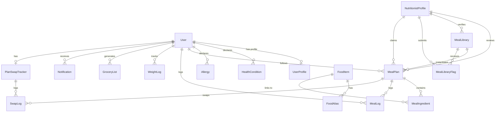

# NutriMind — Integrated System Reference Manual
### Technical Specifications, Database ERD Schema, REST API Directory, and Clinical Logical Flows for SPMP & SRS Documentation

**Status**: Draft System Reference  
**Last Updated**: July 8, 2026  
**Audience**: Technical Writers, Project Managers, and AI Agents generating SPMP (Software Project Management Plan) and SRS (Software Requirements Specification) documents for the NutriMind Capstone project.

---

## 1. Executive Summary & Product Scope
NutriMind is a clinical-grade, full-stack web application designed to bridge the gap between AI-driven meal planning and professional medical nutrition validation. Tailored specifically for the health-conscious urban Filipino demographic and Registered Nutritionist-Dietitians (RNDs), the platform offers a secure, closed-loop clinical verification ecosystem. 

Rather than allowing AI recommendations to bypass clinical oversight, NutriMind funnels every AI-generated meal through a pending review queue for professional validation. The app integrates local food composition data from the **DOST-FNRI (Department of Science and Technology - Food and Nutrition Research Institute)** to ensure high-fidelity nutritional tracking, localized cultural recipe recommendations, and real-time clinical warnings.

---

## 2. Technical Stack & Architecture Configuration
The system consists of two separate, fully integrated codebases communicating via JSON REST services.

### Frontend Client (`nutrimind-frontend`)
* **Framework**: Next.js 14.2.35 (React 18, App Router) running in Node.js development mode.
* **Network Layer**: `Axios` client instance utilizing a custom global interceptor that automatically catches `401 Unauthorized` responses, executes a silent refresh request to fetch a new short-lived JWT token, and replays the original request without user interruption.
* **Token Caching**: Access token (`token`) and refresh token (`nutrimind_refresh`) are stored in JavaScript-readable browser cookies managed through frontend helper functions (`document.cookie`).
* **Styling**: Tailwind CSS with custom global tokens implementing a premium glassmorphic dark theme.
* **Iconography**: `lucide-react` vector iconography.
* **PWA Capability**: Standard PWA manifest and icons are configured in the `public` directory (`manifest.json`, `public/icons/icon-192.png`, and `public/icons/icon-512.png`). A service worker library (such as `next-pwa`) is not currently implemented.

### Backend API Server (`nutrimind-backend`)
* **Runtime**: Express.js in TypeScript running on Node.js.
* **Database Interface**: Prisma Client ORM querying a cloud-hosted Neon Serverless PostgreSQL database.
* **AI Engine**: Google Gemini API via the `@google/generative-ai` SDK, configured with a fallback sequence of four models (`gemini-3.5-flash` → `gemini-2.5-flash` → `gemini-3.1-flash-lite` → `gemini-2.5-pro`) and a low temperature parameter (`0.2`) to guarantee deterministic JSON outputs.
* **PDF Stream Engine**: Server-side document construction via `@react-pdf/renderer` rendering documents into raw Node.js streams.
* **Mail Delivery**: `Nodemailer` with SSL/TLS transport using Google App Passwords for OTP validation and password resets.
* **Security & Limits**: Helmet, CORS, and Express Rate Limit (customized to 500 requests per 15 minutes for development, and 100 requests per 15 minutes for production).

---

## 3. Database Schema Specification (Prisma ERD)
Below is the database entity design as represented in `prisma/schema.prisma`. All tables are migrated in development environments.



### 3.1 Data Dictionary

#### User Model (`User`)
Stores credentials and system role.
* `id` (String, PK, cuid) - Unique user identifier.
* `name` (String) - Full name (concatenated on the frontend as `First Name + Last Name`).
* `email` (String, Unique) - Contact and login email.
* `passwordHash` (String) - Hashed password (BCrypt).
* `role` (Role Enum: `USER`, `NUTRITIONIST`, `ADMIN`) - Authorization tier.
* `emailVerified` (Boolean) - Email verification status.
* `tosAccepted` (Boolean) - Terms of Service acceptance status.
* `onboardingDone` (Boolean) - Onboarding completion status.
* `createdAt` / `updatedAt` (DateTime) - Audit timestamps.

#### UserProfile Model (`UserProfile`)
Stores physical dimensions, dietary limits, and target goals.
* `id` (String, PK, cuid)
* `userId` (String, FK, Unique) - Links to `User`.
* `age` (Int, Nullable) - Age in years.
* `biologicalSex` (String, Nullable) - `"MALE"` or `"FEMALE"`.
* `heightCm` (Float, Nullable) - Height in centimeters.
* `weightKg` (Float, Nullable) - Current weight in kilograms.
* `targetWeightKg` (Float, Nullable) - Target weight in kilograms.
* `goal` (Goal Enum: `LOSE_WEIGHT`, `GAIN_WEIGHT`, `MAINTAIN`, `BUILD_MUSCLE`)
* `activityLevel` (ActivityLevel Enum: `SEDENTARY`, `LIGHTLY_ACTIVE`, `ACTIVE`, `VERY_ACTIVE`)
* `dietaryPreference` (DietaryPreference Enum: `OMNIVORE`, `VEGETARIAN`, `VEGAN`, `PESCATARIAN`)
* `carbPreference` (CarbPreference Enum: `LOW`, `MODERATE`, `HIGH`)
* `dailyCalorieTarget` (Int, Nullable) - Calculated daily energy target.
* `otherConditions` (String, Nullable) - Custom, comma-separated user health conditions.
* `otherAllergies` (String, Nullable) - Custom, comma-separated user allergies.
* `shoppingDayGroup` (ShoppingDayGroup Enum: `WEEKEND`, `WEEKDAY`) - Anchor habit grouping.
* `checkinStreak` (Int) - Consecutive weekly check-in counts.

#### HealthCondition Model (`HealthCondition`)
Links one or more medical conditions to a user.
* `id` (String, PK, cuid)
* `userId` (String, FK) - Links to `User`.
* `condition` (HealthConditionType Enum: `DIABETES`, `HYPERTENSION`, `KIDNEY_DISEASE`, `HEART_CONDITION`, `PREGNANT`, `NONE`)

#### Allergy Model (`Allergy` mapped to `Allgy` table)
Links one or more allergens to a user.
* `id` (String, PK, cuid)
* `userId` (String, FK) - Links to `User`.
* `allergen` (AllergenType Enum: `SHELLFISH`, `NUTS`, `DAIRY`, `GLUTEN`, `EGGS`, `NONE`)

#### NutritionistProfile Model (`NutritionistProfile`)
Stores clinical validation logs, PRC license numbers, and credentials.
* `id` (String, PK, cuid)
* `userId` (String, FK, Unique) - Links to `User`.
* `verifiedByAdminId` (String, FK, Nullable) - Approving admin.
* `prcLicenseNumber` (String, Unique) - Professional Regulatory Commission identification.
* `prcLicenseExpiry` (DateTime) - Expiration date of professional license.
* `specialization` (String, Nullable) - Area of dietetic specialization.
* `university` (String, Nullable) - Education background.
* `bio` (String, Nullable, Text) - Nutritionist professional biography.
* `isVerified` (Boolean) - System verification status.
* `totalVerified` (Int) - Counter tracking how many meal plans this nutritionist has approved.

#### FoodItem Model (`FoodItem`)
Sourced from DOST-FNRI database.
* `id` (String, PK, cuid)
* `name` (String) - Food name.
* `category` (String, Nullable) - Food category (e.g. PRODUCE, MEAT, DAIRY).
* `calories`, `proteinG`, `carbsG`, `fatG` (Float) - Macro targets.
* `sodium`, `fiber`, `potassium`, `calcium`, `iron`, `vitaminA`, `vitaminC` (Float, Nullable) - Micro nutrients.
* `source` (String) - Defaults to `"FNRI"`.

#### MealPlan Model (`MealPlan`)
Tracks active weekly meals and pending nutritionist reviews.
* `id` (String, PK, cuid)
* `planGroupId` (String) - Maps all 21 generated meals in a weekly plan together.
* `userId` (String, FK) - Links to `User`.
* `nutritionistId` (String, FK, Nullable) - Approving nutritionist.
* `libraryMealId` (String, FK, Nullable) - Links to `MealLibrary` templates.
* `status` (MealPlanStatus Enum: `PENDING_REVIEW`, `APPROVED`, `REJECTED`, `CANCELLED`)
* `mealType` (MealType Enum: `BREAKFAST`, `LUNCH`, `DINNER`, `SNACK`)
* `mealName` (String)
* `description` (String, Nullable)
* `calories`, `proteinG`, `carbsG`, `fatG` (Float)
* `aiConfidenceFlag` (AIConfidenceFlag Enum: `SAFE`, `CAUTION`, `NEEDS_REVIEW`)
* `planType` (PlanType Enum: `STARTER`, `WEEKLY`)
* `nutritionistNote` (String, Nullable) - Review notes shown to user.
* `scheduledDate` (DateTime) - Target date for consumption.
* `claimedByNutritionistId` (String, FK, Nullable) - Nutritionist claiming the soft review lock.
* `claimedAt` (DateTime, Nullable) - Timestamp of soft lock lease.

#### MealLibrary Model (`MealLibrary`)
Templates of dietitian-verified meals.
* `id` (String, PK, cuid)
* `verifiedByNutritionistId` (String, FK, Nullable) - Original RND who verified the meal.
* `mealName` (String)
* `description` (String, Nullable)
* `mealType` (MealType)
* `calories`, `proteinG`, `carbsG`, `fatG` (Float)
* `suitableConditions` (Json) - List of conditions this meal is safe for.
* `allergenFree` (Json) - List of allergens this meal does not contain.
* `dietaryTags` (Json) - Dietary preferences and goals tags.
* `usageCount` (Int) - Number of times this template has been used.
* `status` (MealLibraryStatus Enum: `APPROVED`, `FLAGGED`)

#### MealIngredient Model (`MealIngredient`)
Stores ingredient items.
* `id` (String, PK, cuid)
* `mealPlanId` (String, FK) - Links to `MealPlan`.
* `foodItemId` (String, FK, Nullable) - Links to `FoodItem` (FNRI).
* `ingredientName` (String)
* `category` (String, Nullable) - Category name.
* `dataSource` (MealIngredientDataSource Enum: `FNRI`, `GEMINI_ESTIMATED`) - Tracks if nutrient data is FNRI-verified or AI-estimated.

#### PlanSwapTracker & SwapLog Model
Tracks user swaps.
* `PlanSwapTracker`: Tracks `swapsUsed` (Int) for a `planGroupId`.
* `SwapLog`: Logs individual swap deltas. Tracks `calorieDelta` (Float), `warningShown` (Boolean), and `warningAcknowledged` (Boolean).

#### MealLibraryFlag Model (`MealLibraryFlag`)
Tracks nutritionist flagging of database entries.
* `id` (String, PK)
* `mealLibraryId` (String, FK) - Links to `MealLibrary`.
* `flaggedByNutritionistId` (String, FK) - Flagging nutritionist.
* `reason` (String) - Flagging reason.
* `status` (FlagStatus Enum: `PENDING`, `RESOLVED_REMOVED`, `RESOLVED_KEPT`)

---

## 4. Operational Feature Specifications & Logical Flows

### 4.1 Authentication & RBAC
NutriMind enforces strict Role-Based Access Control:
* **JSON Web Tokens (JWT)**: Login generates a short-lived Access Token (15-minute expiry) returned in JSON and a Refresh Token (7-day expiry) returned in JSON and cached in cookies.
* **RBAC Route Protection**: Middleware checks role claims before access:
  * `requireRole('USER')`: Limits access to client onboarding, meals, and reports.
  * `requireRole('NUTRITIONIST')`: Limits access to reviews queue and library.
  * `requireRole('ADMIN')`: Limits access to analytics and nutritionist verification.
* **Axios Silent Refresh**: Caught 401 errors trigger a refresh request. On success, headers are updated and original calls are replayed seamlessly.

### 4.2 Mifflin-St Jeor Calorie Target Calculations
Daily energy budgets are computed dynamically on the server:
1. **Biological Sex Override**:
   * If the user's `healthConditions` includes `PREGNANT`, biological sex is set to `FEMALE` for calculations, regardless of user selection.
2. **BMR Formulas**:
   * **Male**: $BMR = (10 \times \text{weightKg}) + (6.25 \times \text{heightCm}) - (5 \times \text{age}) + 5$
   * **Female**: $BMR = (10 \times \text{weightKg}) + (6.25 \times \text{heightCm}) - (5 \times \text{age}) - 161$
3. **Total Daily Energy Expenditure (TDEE)**:
   * $TDEE = BMR \times \text{Activity Multiplier}$
   * *Multipliers*: `SEDENTARY` (1.2), `LIGHTLY_ACTIVE` (1.375), `ACTIVE` (1.55), `VERY_ACTIVE` (1.725).
4. **Target Adjustments**:
   * `LOSE_WEIGHT`: $TDEE - 500$
   * `GAIN_WEIGHT`: $TDEE + 500$
   * `BUILD_MUSCLE`: $TDEE + 300$
   * `MAINTAIN`: $TDEE$
   * *Starvation Floor*: A hard limit of `500 kcal` daily target is enforced to prevent crash dieting.

### 4.3 Shopping-Day Anchored Cycles & Starter Plans
Meal plans are anchored to each user's shopping preference (`shoppingDayGroup`):
* `WEEKEND` shoppers $\rightarrow$ week start is Sunday (Sunday-Saturday cycle).
* `WEEKDAY` shoppers $\rightarrow$ week start is Monday (Monday-Sunday cycle).

If a user signs up mid-week (e.g., Wednesday), generating a full 7-day plan would mismatch their next shopping run. The system calculates the remaining days until their next cycle start:
$$\text{daysUntilStart} = (\text{weekStartDow} - \text{todayDow} + 7) \pmod 7$$
It generates a partial **STARTER** plan covering this duration. When the anchor day is reached, the automated check-in triggers a full 7-day **WEEKLY** plan.

```
Onboarding Completed (Mid-Week)
             │
             ▼
Calculate days until next Cycle Start
             │
             ├─► daysUntilStart == 0 ──► Generate full 7-day WEEKLY plan
             │
             └─► daysUntilStart > 0  ──► Generate partial STARTER plan
                                                    │
                                                    ▼
                                     On weekStartDay, Cron triggers check-in
                                                    │
                                                    ▼
                                     Generate full 7-day WEEKLY plan
```

### 4.4 Localized AI Meal Generation & DOST-FNRI Lookup Chain
When generating a meal plan, the server follows a tiered verification hierarchy:
1. **Meal Library Inspection**: The system queries the `MealLibrary` for nutritionist-approved, compatible meals matching the target slot (Breakfast, Lunch, Dinner) and the user's specific health conditions, allergens, and dietary preferences.
2. **Monotony Prevention**: If multiple matches are found, candidates are sorted by their historical `usageCount` ascending to rotate meals.
3. **LLM Fallback**: For unmatched slots, the server requests Gemini AI (`temperature: 0.2` with Zod schema verification) to generate meals. It injects a pre-seeded dictionary of DOST-FNRI ingredients to encourage local choices.
4. **Ingredient Verification Chain**:
   * **Exact Match**: Resolves against `FoodItem.name` in the database.
   * **Alias Match**: Resolves against registered aliases in `FoodAlias`.
   * **Fuzzy Match**: Resolves using case-insensitive contains `contains: name, mode: 'insensitive'` on database rows.
   * **AI Estimation**: If all matches fail, the ingredient is saved as `GEMINI_ESTIMATED`.
5. **AI Confidence Level Calculation**:
   * Clinical conditions + $\ge 1$ estimated ingredient $\rightarrow$ `NEEDS_REVIEW`
   * Clinical conditions + all database-verified ingredients $\rightarrow$ `CAUTION`
   * No clinical conditions $\rightarrow$ `SAFE`

### 4.5 Pre-Computed Warning System
To ensure safety, the backend pre-computes four clinical checks for card details:
* **Check 1: Allergen Scan (CRITICAL - Red)**: Compares ingredients against keyword mappings (e.g., `EGGS` matches "egg", "itlog"; `SHELLFISH` matches "shrimp", "hipon", "tahong"). Raises alerts if matches are found.
* **Check 2: Condition Limits (IMPORTANT - Amber)**:
  * `DIABETES`: Carbs per meal $> 60\text{g}$.
  * `HYPERTENSION`: Total estimated sodium in the meal $> 800\text{mg}$.
  * `HEART_CONDITION`: Fat per meal $> 20\text{g}$.
  * `KIDNEY_DISEASE`: Protein per meal $> 40\text{g}$.
  * `PREGNANT`: Triggers general prenatal checking notice.
* **Check 3: Calorie Fit (NOTICE - Blue)**: Alerts if a single meal exceeds $50\%$ of the user's daily budget.
* **Check 4: Database Coverage (IMPORTANT - Amber)**: Surfaces names of any ingredients using `GEMINI_ESTIMATED` metrics.

### 4.6 Soft Claim Locking
To avoid double-pickup conflicts when multiple nutritionists manage the pending reviews queue:
1. **Setting the Claim**: Opening a pending meal card detailed page requests `GET /queue/:id` which updates the database table, setting `claimedByNutritionistId` and `claimedAt = now`.
2. **General Hiding**: The general queue endpoint (`GET /queue`) hides active claims (claims where `claimedAt` is less than 30 minutes old and held by other dietitians). 
3. **Soft Lock Notice**: If a nutritionist manually accesses a card claimed by someone else, they see a warning: *"👁️ [Name] is currently reviewing this meal..."*
4. **Resolution Check**: Resolving the card checks the claim owner. If the lock was taken over or expired, the backend rejects the update with a `409 Conflict` status, prompting the nutritionist to refresh their queue.
5. **Auto-Release**: Claims older than 30 minutes are automatically ignored during queries, returning to the general queue without requiring a background cron clean-up.

```
                  Nutritionist A opens Review Card
                                  │
                                  ▼
                    Is active claim held by other?
                                  │
                  ┌───────────────┴───────────────┐
                  ▼ YES                           ▼ NO
        Show soft-lock warning banner     A claims the card (30m lease)
                  │                               │
                  ▼                               ▼
        A submits approval              A submits approval
                  │                               │
                  ▼                               ▼
       Check: is A still owner?        Check: is A still owner?
                  │                               │
          ┌───────┴───────┐                       │
          ▼ YES           ▼ NO                    ▼
       Approve       Return 409 Conflict       Approve
                     "Claim taken over"
```

### 4.7 User-Facing Meal Swaps
* Users can swap planned meals using verified options in the `MealLibrary`.
* Swaps are limited to **3 swaps per week** per `planGroupId`.
* **Projected Calorie Preview**: Selecting a swap displays a delta preview. The system checks daily calorie targets and highlights a warning if the projected daily total falls outside a $\pm 15\%$ range of their target.

### 4.8 PDF Streaming Engine
Two reports are generated as PDF streams using server-side `@react-pdf/renderer` components:
- **Nutrition Report PDF**: Renders user details, target calories, conditions, allergies, general AI-generated summary, foods to recommend, limit, and avoid, and fluid targets.
- **Grocery Checklist PDF**: Prints active ingredients grouped by category (e.g. PRODUCE, PANTRY, MEAT) with checkbox markers.

---

## 5. Complete REST API Endpoint Reference Directory

### 5.1 Authentication API (`/api/auth`)

#### Register User
* **Route**: `POST /api/auth/register`
* **Description**: Registers new user credentials.
* **Payload**:
  ```json
  {
    "name": "Juan Dela Cruz",
    "email": "juan@example.com",
    "password": "Password123"
  }
  ```
* **Success Response**:
  ```json
  {
    "success": true,
    "data": {
      "user": {
        "id": "user-cuid",
        "name": "Juan Dela Cruz",
        "email": "juan@example.com",
        "role": "USER",
        "emailVerified": false,
        "onboardingDone": false
      },
      "accessToken": "access-token-jwt",
      "refreshToken": "refresh-token-jwt"
    }
  }
  ```

#### Credentials Login
* **Route**: `POST /api/auth/login`
* **Description**: Authenticates users.
* **Payload**:
  ```json
  {
    "email": "juan@example.com",
    "password": "Password123"
  }
  ```
* **Success Response**:
  ```json
  {
    "success": true,
    "data": {
      "user": { 
        "id": "user-cuid", 
        "name": "Juan Dela Cruz", 
        "email": "juan@example.com",
        "role": "USER", 
        "emailVerified": true, 
        "onboardingDone": true 
      },
      "accessToken": "access-jwt",
      "refreshToken": "refresh-jwt"
    }
  }
  ```

#### Google OAuth SignIn
* **Route**: `POST /api/auth/google`
* **Description**: Verifies Google client credentials.
* **Payload**:
  ```json
  {
    "idToken": "google-id-token-string"
  }
  ```
* **Success Response**:
  ```json
  {
    "success": true,
    "data": {
      "user": { "id": "user-cuid", "name": "Juan", "email": "juan@gmail.com", "role": "USER" },
      "accessToken": "access-jwt",
      "refreshToken": "refresh-jwt"
    }
  }
  ```

#### Verify OTP Email
* **Route**: `POST /api/auth/verify-email`
* **Description**: Verifies the 6-digit OTP code sent to user's email. Requires auth token.
* **Payload**:
  ```json
  {
    "otp": "123456"
  }
  ```
* **Success Response**:
  ```json
  {
    "success": true,
    "data": { "emailVerified": true, "message": "Email verified successfully." }
  }
  ```

#### Token Refresh
* **Route**: `POST /api/auth/refresh`
* **Description**: Validates refresh token and issues a new access token.
* **Payload**:
  ```json
  {
    "refreshToken": "refresh-token-jwt"
  }
  ```
* **Success Response**:
  ```json
  {
    "success": true,
    "data": { "token": "new-access-jwt" }
  }
  ```

#### User Logout
* **Route**: `POST /api/auth/logout`
* **Description**: Invalidates cookies. Requires auth token.
* **Success Response**:
  ```json
  {
    "success": true
  }
  ```

---

### 5.2 User Profile & Onboarding API (`/api/user`)

#### Save Onboarding Stats
* **Route**: `POST /api/user/onboarding/profile`
* **Description**: Saves physical statistics and target goals. Calculates daily calorie targets.
* **Payload**:
  ```json
  {
    "age": 25,
    "biologicalSex": "MALE",
    "heightCm": 175.5,
    "weightKg": 70.0,
    "targetWeightKg": 68.0,
    "goal": "LOSE_WEIGHT",
    "activityLevel": "ACTIVE"
  }
  ```
* **Success Response**:
  ```json
  {
    "success": true,
    "data": { "id": "profile-cuid", "dailyCalorieTarget": 2100 }
  }
  ```

#### Save Onboarding Conditions
* **Route**: `POST /api/user/onboarding/conditions`
* **Description**: Saves declared conditions and custom inputs.
* **Payload**:
  ```json
  {
    "conditions": ["DIABETES", "HYPERTENSION"],
    "otherConditions": "Gout"
  }
  ```

#### Save Onboarding Allergies
* **Route**: `POST /api/user/onboarding/allergies`
* **Description**: Saves declared allergies and custom inputs.
* **Payload**:
  ```json
  {
    "allergies": ["NUTS", "DAIRY"],
    "otherAllergies": "Sesame"
  }
  ```

#### Save Onboarding Shopping Day Group
* **Route**: `POST /api/user/onboarding/shopping-day`
* **Description**: Sets the weekly cycle anchor.
* **Payload**:
  ```json
  {
    "shoppingDayGroup": "WEEKEND"
  }
  ```

#### Save Onboarding ToS Acceptance
* **Route**: `POST /api/user/onboarding/tos`
* **Description**: Saves TOS flags.
* **Payload**:
  ```json
  {
    "tosAccepted": true
  }
  ```

#### Fetch User Profile
* **Route**: `GET /api/user/profile`
* **Description**: Returns the active user profile data. Note: profile fields are returned directly under the `data` payload.
* **Success Response**:
  ```json
  {
    "success": true,
    "data": {
      "id": "user-cuid",
      "name": "Juan Dela Cruz",
      "email": "juan@example.com",
      "role": "USER",
      "emailVerified": true,
      "tosAccepted": true,
      "onboardingDone": true,
      "userProfile": {
        "age": 25,
        "biologicalSex": "MALE",
        "heightCm": 175.5,
        "weightKg": 70.0,
        "dailyCalorieTarget": 2100,
        "shoppingDayGroup": "WEEKEND"
      },
      "healthConditions": ["DIABETES"],
      "allergies": ["NUTS"]
    }
  }
  ```

---

### 5.3 AI Nutrition Report API (`/api/user/nutrition-report`)

#### Generate Clinical Report
* **Route**: `POST /api/user/nutrition-report/generate`
* **Description**: Requests Gemini to generate a clinical summary.
* **Success Response**:
  ```json
  {
    "success": true,
    "data": {
      "id": "report-cuid",
      "generalSummary": "Clinical recommendation based on Diabetes...",
      "foodsRecommended": ["Oats", "Spinach"],
      "foodsToAvoid": ["Softdrinks", "White bread"],
      "drinksGuidance": ["Water: 3L daily"]
    }
  }
  ```

#### Acknowledge Report
* **Route**: `POST /api/user/nutrition-report/acknowledge`
* **Description**: Sets acknowledgement flag to unblock client portal dashboard.
* **Success Response**:
  ```json
  {
    "success": true
  }
  ```

#### Stream Report PDF
* **Route**: `GET /api/user/nutrition-report/pdf`
* **Description**: Streams the server-side generated PDF file directly.
* **Response Content-Type**: `application/pdf`

---

### 5.4 Meal Plan & Logging API (`/api/user/meals`)

#### Generate Plan
* **Route**: `POST /api/user/meals/generate`
* **Description**: Triggers weekly plan generation (checks library + Gemini).
* **Success Response**:
  ```json
  {
    "success": true,
    "data": { "message": "Meal plan generated successfully.", "planGroupId": "uuid-string" }
  }
  ```

#### Fetch Current Plan
* **Route**: `GET /api/user/meals/current`
* **Description**: Returns scheduled meals for the active cycle.
* **Success Response**:
  ```json
  {
    "success": true,
    "data": [
      {
        "id": "plan-cuid",
        "mealName": "Beef Tapa",
        "mealType": "BREAKFAST",
        "calories": 450,
        "scheduledDate": "2026-07-08T00:00:00.000Z",
        "ingredients": [
          { "ingredientName": "Beef", "dataSource": "FNRI" }
        ]
      }
    ]
  }
  ```

#### Log Outside Meal
* **Route**: `POST /api/user/meals/log-outside`
* **Description**: Estimates and logs outside meal consumption. Requires user acknowledgement if warnings are found.
* **Payload**:
  ```json
  {
    "mealName": "Sweet Spaghetti",
    "mealType": "LUNCH",
    "warningAcknowledged": false
  }
  ```
* **Response (Conflict Warning - when warningRequired is true)**:
  ```json
  {
    "success": true,
    "data": {
      "warningRequired": true,
      "warnings": ["CONDITION"],
      "reasons": ["High simple sugar content estimated (24g), which may spike blood glucose for Diabetics."],
      "estimate": {
        "calories": 480,
        "proteinG": 12,
        "carbsG": 72,
        "fatG": 16
      }
    }
  }
  ```
* **Response (Success - after sending warningAcknowledged: true)**:
  ```json
  {
    "success": true,
    "data": {
      "id": "log-cuid",
      "mealName": "Sweet Spaghetti",
      "calories": 480,
      "loggedAt": "2026-07-08T07:07:00.000Z"
    }
  }
  ```

#### Toggle Meal Status
* **Route**: `PATCH /api/user/meals/:id/status`
* **Description**: Toggles done/skipped status logs.
* **Payload**:
  ```json
  {
    "status": "DONE",
    "notes": "Eaten at home"
  }
  ```

#### Fetch Compatible Swaps
* **Route**: `GET /api/user/meals/:id/swap-options`
* **Description**: Returns compatible approved replacement options from MealLibrary.
* **Success Response**:
  ```json
  {
    "success": true,
    "data": {
      "swapOptions": [
        { "id": "lib-cuid", "mealName": "Vegan Champorado", "calories": 420 }
      ],
      "swapsUsed": 1,
      "swapCap": 3
    }
  }
  ```

#### Preview Swap Delta
* **Route**: `GET /api/user/meals/:id/swap-preview?libraryMealId=lib-cuid`
* **Description**: Previews projected daily calorie totals.
* **Success Response**:
  ```json
  {
    "success": true,
    "data": {
      "originalMealName": "Beef Tapa",
      "originalCalories": 450,
      "newMealName": "Vegan Champorado",
      "newCalories": 420,
      "calorieDelta": -30,
      "projectedDayTotal": 1950,
      "dailyTarget": 2000,
      "warningRequired": false
    }
  }
  ```

#### Confirm Swap
* **Route**: `POST /api/user/meals/:id/swap`
* **Description**: Swaps plan slot and clones verified ingredients.
* **Payload**:
  ```json
  {
    "newLibraryMealId": "lib-cuid",
    "warningShown": false,
    "warningAcknowledged": false
  }
  ```

---

### 5.5 Grocery API (`/api/user/grocery`)

#### Fetch Current Grocery List
* **Route**: `GET /api/user/grocery/current`
* **Description**: Returns grocery items grouped by categories.
* **Success Response**:
  ```json
  {
    "success": true,
    "data": {
      "weekLabel": "Week 1",
      "groceryItems": [
        { "id": "item-cuid", "ingredientName": "Beef", "category": "MEAT", "isChecked": false }
      ]
    }
  }
  ```

#### Stream Grocery PDF
* **Route**: `GET /api/user/grocery/pdf`
* **Description**: Streams grocery list PDF directly.
* **Response Content-Type**: `application/pdf`

#### Toggle Grocery Item Checkbox
* **Route**: `PATCH /api/user/grocery/items/:id/toggle`
* **Description**: Toggles item checked state.
* **Success Response**:
  ```json
  {
    "success": true,
    "data": { "id": "item-cuid", "isChecked": true }
  }
  ```

---

### 5.6 Nutritionist Portal API (`/api/nutritionist`)

#### Fetch Queue
* **Route**: `GET /api/nutritionist/queue`
* **Description**: Returns unclaimed pending reviews.
* **Success Response**:
  ```json
  {
    "success": true,
    "data": [
      {
        "id": "meal-cuid",
        "mealName": "Beef Tapa",
        "aiConfidenceFlag": "CAUTION",
        "claimStatus": { "claimedByOther": false, "claimedByName": null }
      }
    ]
  }
  ```

#### Fetch Card Details (Sets Soft Lock Claim)
* **Route**: `GET /api/nutritionist/queue/:id`
* **Description**: Sets the claim lock and returns profile details, ingredients, and auto-warnings.
* **Success Response**:
  ```json
  {
    "success": true,
    "data": {
      "mealPlan": { "id": "meal-cuid", "mealName": "Beef Tapa" },
      "user": { "name": "Juan", "age": 25, "conditions": ["HYPERTENSION"], "allergies": [] },
      "ingredients": [
        { "name": "Beef", "source": "FNRI" }
      ],
      "warnings": [
        { "severity": "IMPORTANT", "message": "⚠️ High sodium estimate — user has hypertension." }
      ],
      "claimStatus": { "claimedByMe": true, "claimedByOther": false, "claimedByName": null }
    }
  }
  ```

#### Resolve Review (Approve/Reject)
* **Route**: `PATCH /api/nutritionist/review/:id`
* **Description**: Approves (with optional updates) or rejects (triggers AI replacement) a meal plan.
* **Payload (Approve with updates)**:
  ```json
  {
    "action": "approve",
    "note": "Great low-carb option.",
    "updates": {
      "calories": 420,
      "ingredients": [
        { "name": "Sirloin Beef", "category": "MEAT", "dataSource": "FNRI" }
      ]
    }
  }
  ```
* **Payload (Reject)**:
  ```json
  {
    "action": "reject",
    "note": "Too high in sodium."
  }
  ```
* **Conflict Response (If claimed by another nutritionist)**:
  * **Status Code**: `409 Conflict`
  * **Payload**:
    ```json
    {
      "success": false,
      "error": "This meal was already claimed by Another Nutritionist. Please refresh the queue."
    }
    ```

---

### 5.7 Admin API (`/api/admin`)

#### Get Platform Analytics
* **Route**: `GET /api/admin/analytics`
* **Description**: Returns platform analytics.
* **Success Response**:
  ```json
  {
    "success": true,
    "data": {
      "totalUsers": 125,
      "pendingReviews": 47,
      "totalVerifiedMeals": 1240
    }
  }
  ```

#### Verify Nutritionist Profile
* **Route**: `PATCH /api/admin/nutritionists/:id/verify`
* **Description**: Approves nutritionist credentials.
* **Payload**:
  ```json
  {
    "isVerified": true
  }
  ```

---

## 6. Premium UI Component Library
The frontend is constructed using atomic UI components styled in Tailwind CSS:

* **CalorieRing**: A SVG circular progress tracker. Integrates dynamic macro rings tracking daily targets, logs, and compliance indices.
* **Sidebar**: A collapsible navigation pane. Toggles access panels according to authorization roles (Pending Reviews for Nutritionists, Admin Analytics for Administrators). Collapses on mobile.
* **BottomNav**: Sticky mobile tab bar visible on screens $< 768\text{px}$.
* **Radix Dialog Modal**: Utilized for Outside Meal entries, confirmation prompts, and weekly check-in forms.
* **Red Badge Chips**: Display health indicators, allergies, and warnings dynamically. Badges strictly support: `verified`, `pending`, `rejected`, `ai`, and `user` variants.
* **Warning Banner**: Embedded in meals view when displaying unverified `PENDING_REVIEW` items.

---

## 7. Known Gaps & Risks

### Security & Token Storage
* **Cookie Caching**: Access tokens and session refresh values are cached in client-accessible browser cookies instead of HttpOnly cookies. This makes them vulnerable to XSS projection if malicious third-party scripts are injected.
* **Exception Leakage**: Some controllers output unparsed database errors (`error.message`) in JSON responses, which can expose table names or schema constraints.

### Logical Boundaries
* **Check-In Streak Deceleration**: Streaks correctly increment upon successful weekly check-ins, but the backend lacks automatic degradation logic for missed check-in windows.
* **Database Coverage checks**: Allergen scanning and condition thresholds are based on string category maps. Ingredients containing minor formatting variations (e.g., typos) may bypass validation filters if not exact.

---

## 8. Verification & Quality Auditing
* **Database Migrations**: Successfully configured, verified, and run using `npx prisma migrate dev`.
* **Static Verification**:
  * Backend TypeScript compiling passes cleanly with `0 errors` using `npx tsc --noEmit`.
  * Frontend compilation passes cleanly with `0 errors` via `npx next build`.
* **Google OAuth Validation**: Bound strictly to port `3000` on localhost for origin alignment.
* **Dev Rate Limiting**: Shifted to 500 requests per 15 minutes to support rapid hot reload refreshes.
