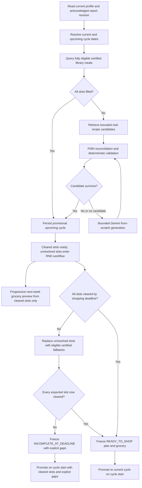
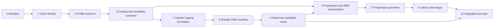
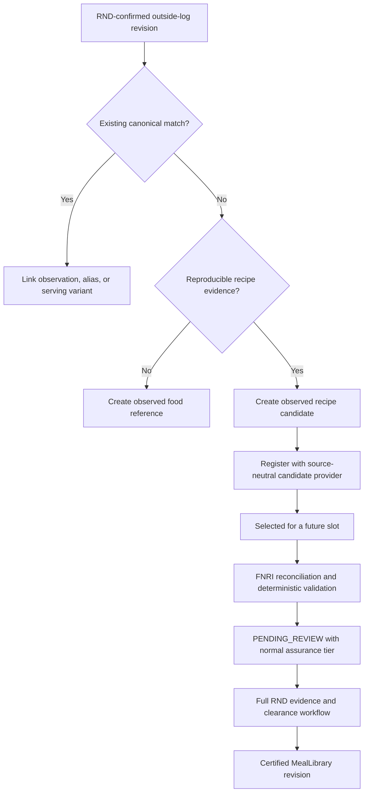

# KAINARA Core Workflow Implementation Sequence

**Recorded:** September 22, 2026  
**Status:** Owner-approved product and architecture plan; implementation evidence must be recorded separately  
**Scope:** Weekly planning, profile revisions, upcoming-cycle preparation, groceries, eligible library browsing, favorites, meal swaps, outside-meal logging/review, and candidate-corpus growth  
**Canonical implementation evidence:** [`NUTRIMIND_ENGINEERING_RECORD.md`](NUTRIMIND_ENGINEERING_RECORD.md)

## 1. Purpose

This document preserves the decisions made in the September 22 core-feature design Q&A and fixes their implementation order. It exists so future work does not reconstruct requirements from chat history, combine incompatible states, or accidentally claim that a planned behavior is already implemented.

The ordering follows one rule: build the source of truth before building anything derived from it. In practical terms:

- cycle identity precedes plan preparation;
- acknowledged profile revisions precede candidate selection;
- plan readiness precedes grocery readiness;
- grocery behavior precedes swap behavior;
- immutable outside-log revisions precede nutritionist correction;
- confirmed observed-food records precede reuse as plan candidates.

No batch may be marked implemented merely because its schema or UI exists. Each batch has an exit gate that must pass before dependent work starts.

## 2. Authority and relationship to existing records

This is a forward implementation contract, not proof of current runtime behavior.

- Current executable code and [`NUTRIMIND_ENGINEERING_RECORD.md`](NUTRIMIND_ENGINEERING_RECORD.md) remain authoritative for what exists now.
- [`NUTRIMIND_LIBRARY_SAFETY_EVIDENCE_DESIGN.md`](NUTRIMIND_LIBRARY_SAFETY_EVIDENCE_DESIGN.md) remains the detailed safety-evidence design.
- [`OUTSIDE_MEAL_INTELLIGENCE.md`](OUTSIDE_MEAL_INTELLIGENCE.md) records the existing outside-meal implementation. This plan changes and extends that workflow; it must reuse the existing `MealLog`, `OutsideMealLogItem`, `OutsideMealItemRevision`, `OutsideMealReview`, and `OutsideMealPreview` models where appropriate instead of silently creating a second unrelated logging system.
- [`NEXT_FEATURES_HANDOFF.md`](NEXT_FEATURES_HANDOFF.md) contains historical subscription and advance-cycle decisions. The September 22 subscription removal remains authoritative: future-cycle preparation described here is a universal core workflow and must not restore billing, entitlements, paid swap caps, test-access grants, or Premium UI.
- Proposed state and field names in this document are semantic names. Before a migration is written, map them to the current Prisma schema and record any naming deviation. Do not create duplicate fields merely to match wording in this document.

## 3. Explicit scope boundaries

### 3.1 Included

- A current plan and one upcoming plan under preparation.
- Shopping day as the final active day and preparation day, with the next cycle starting the following day.
- Profile and safety revision behavior across current and upcoming cycles.
- Candidate sourcing from the certified library, the broader real-recipe corpus, and Gemini as the last source.
- Deadline-aware nutritionist review.
- A progressive next-week grocery preview containing cleared slots only.
- User favorites and meal-type labels.
- Swapping current and cleared upcoming meals from the eligible library.
- Outside meals from library, manual, FNRI, and AI sources.
- Optional photos, clarification, immutable revisions, and nutritionist confirmation.
- Deidentified, reproducible outside meals becoming broader-corpus candidates.

### 3.2 Excluded

- A user subscription, full-system paywall, Premium tier, payment adapter, entitlement, paid future-plan access, or paid swap allowance.
- A promise that every outside log receives human review.
- Treating raw-corpus origin, popularity, an image, an AI confidence score, or a user favorite as safety evidence.
- Treating confirmation of one consumed meal estimate as reusable recipe certification.
- A general-purpose user-to-nutritionist chat system.
- Using private notes, identity, or an unconsented user photo as shared recipe content.
- Allowing pending meals to become actionable merely because they occur later in the week.

## 4. Fixed terminology

| Term | Exact meaning |
| --- | --- |
| **Certified library meal** | A `MealLibrary` record with current base evidence and every domain of evidence required for the requesting user. Certification is revision- and policy-bound. |
| **Eligible meal** | A meal that may be used by one specific user for one requested slot after all hard diet, allergen, condition, meal-type, and evidence checks pass. Eligibility is contextual, not a permanent global label. |
| **Cleared plan slot** | A slot containing an eligible meal and the exact evidence/clearance references that justified selection. |
| **Candidate** | A possible recipe from the raw corpus, observed-food corpus, or Gemini. Candidate status supplies no safety authority. |
| **Current cycle** | The active dated plan cycle whose `MealPlanCycleSnapshot` is immutable. |
| **Upcoming cycle** | The next dated cycle being prepared before shopping day. It is not actionable until published. |
| **Estimated outside meal** | A logged intake whose effective nutrition has not been confirmed by an RND. It still contributes to the tracker when it has usable nutrition. |
| **Confirmed outside meal** | One exact outside-log revision whose macro estimate was confirmed or corrected by an eligible RND. This confirms the estimate, not reusable safety. |
| **Observed food reference** | A deidentified canonical food/serving record useful for autocomplete or estimation but not reproducible enough for meal-plan generation. |
| **Observed recipe candidate** | A deidentified, reproducible meal derived from a confirmed outside log and admitted to the broader candidate corpus. |
| **Ready to shop** | Every expected slot in the upcoming cycle is cleared, grocery aggregation is current, and the complete list may be checked/exported. |
| **Incomplete at deadline** | The shopping cutoff arrived with one or more unresolved slots. Confirmed ingredients may be shown as an explicitly incomplete subset, but missing slots stay unavailable and the cycle must never be represented as complete. |

Avoid the unqualified word **verified** in new contracts. Use the specific evidence or state being described.

## 5. System-wide invariants

These invariants apply to every batch and are not optional optimizations.

1. **Fresh profile at request boundary.** Candidate selection reads the current persisted profile and its revision; it does not trust a cached client profile.
2. **Acknowledged-report boundary.** A revised upcoming plan may not be finalized from an unacknowledged nutrition report.
3. **Immutable active target.** Ordinary profile changes never rewrite the active cycle's `MealPlanCycleSnapshot`.
4. **Immediate safety response.** New allergies, conditions, pregnancy, and hard dietary exclusions revalidate current and upcoming slots immediately.
5. **No inferred safety.** Empty declarations, real-recipe origin, popularity, imagery, AI confidence, and previous use never mean safe.
6. **Exact evidence dependency.** Every reusable plan selection persists the exact clearance/evidence that justified it.
7. **Candidate provenance is trace-only.** `RAW_RECIPE_CORPUS`, a future observed-recipe provenance, and `AI_FROM_SCRATCH` do not alter review requirements.
8. **Only cleared slots affect groceries.** Pending candidates never contribute ingredients to an actionable grocery list.
9. **Retrospective logging records reality.** A user may record an incompatible food; the system warns but does not erase or block the record.
10. **No destructive edit history.** Outside-log edits append revisions. RND decisions bind to an exact revision.
11. **User preference never overrides eligibility.** Favorites, locality, rice preference, price, and variety apply only after safety and evidence gates.
12. **No silent downgrade.** If evidence, policy, recipe signature, or reviewer eligibility becomes invalid, matching fails closed and dependent slots are marked for revalidation.
13. **Account deletion remains truthful.** Every new user-owned row and stored private image must follow the existing deletion contract.
14. **Asia/Manila cycle time.** Shopping deadlines, cycle dates, preparation windows, and daily quota boundaries use the project's declared planning timezone.
15. **Bounded work.** Queries are paginated/bounded, retries are finite, generation is idempotent, and mutations use transactions or compare-and-set guards where concurrent actors can race.
16. **Shopping freezes automatic expansion.** Once shopping starts, delayed reviews, ranking, or ordinary profile changes cannot silently add ingredients. Any later replacement that changes groceries requires an explicit user action and delta warning.
17. **User-selected upcoming slots are stable.** An eligible upcoming swap is pinned against ordinary re-ranking. Only a new user swap or a safety/profile change that invalidates it may replace it.
18. **Future consumption is not loggable.** Future current-cycle and upcoming slots may be viewed or swapped where allowed, but cannot be marked eaten or skipped before their scheduled date.
19. **Retrospective warnings follow truthful capture.** Outside-meal safety findings are shown after the immutable consumption record is committed; they cannot pressure a user to suppress or alter what was actually consumed.
20. **Shared observations require consent.** A private outside log, note, or image never enters a shared candidate corpus without the applicable recorded reuse permission and deidentification boundary.

## 6. End-to-end target workflow



## 7. Batch dependency graph



The arrow from Batch 9 back into Batch 4 means Batch 4 must define a source-neutral candidate-provider interface. Panlasang and Gemini can operate before observed candidates exist; Batch 9 later registers the observed provider without rewriting the planner.

---

## 8. Batch 0 — Baseline, inventory, and contract freeze

### Objective

Create a truthful starting point and remove ambiguity before schema or behavior changes.

### Work

1. Record the current branch/commit, migration count, database target classification, and clean/dirty Git state.
2. Capture aggregate counts only for:
   - users and profiles;
   - current/future plan groups and cycle snapshots;
   - grocery lists/items;
   - certified/incomplete library records;
   - raw recipe candidates;
   - condition clearances and usages;
   - outside logs/items/revisions/reviews;
   - active RND claims.
3. Inventory current services and endpoints that compute a plan window from live `shoppingDayOfWeek` or `shoppingDayGroup`.
4. Inventory all consumers of `MealPlan.status`, `GroceryList.planGroupId`, and the outside-meal status enums.
5. Map every semantic state proposed here to an existing enum/field or a required additive change.
6. Identify existing migrations and tests that reference the removed subscription-era next-plan behavior. Historical migrations remain immutable.
7. Write a dry-run migration/backfill report before any shared-development schema change.
8. Add a traceability checklist linking each later batch to requirements, migrations, tests, and engineering-record entries.

### Must not happen

- No production or shared-development mutation during inventory.
- No state may be renamed without a compatibility/backfill plan.
- No historical migration may be edited.
- No existing behavior may be called defective solely because this plan proposes a different future state.

### Exit gate

- Current behavior is documented from code and read-only evidence.
- Proposed-to-current naming map exists.
- Migration ownership and rollback approach are explicit.
- The test baseline is green or every pre-existing failure is recorded.

---

## 9. Batch 1 — Current/upcoming cycle source of truth

### Objective

Make dated cycle identity independent from the user's live shopping preference and establish one current cycle plus one upcoming cycle.

### Existing foundation to preserve

- `MealPlan.planGroupId`
- `MealPlan.planType`
- `MealPlan.scheduledDate`
- `MealPlanCycleSnapshot`
- `UserProfile.shoppingDayGroup`
- `UserProfile.shoppingDayOfWeek`
- current cycle policy where the plan starts the day after shopping day

### Required behavior

For a Saturday shopper:

- the active weekly window is Sunday through Saturday;
- Saturday remains a valid active meal day;
- Saturday is also the preparation/shopping day for the next Sunday-through-Saturday cycle;
- the upcoming plan is prepared before Saturday and promoted on Sunday;
- generation is not initiated for the first time on Sunday morning.

### Data contract

Keep the existing `MealPlanCycleSnapshot` for immutable planning inputs and targets. Add a first-class `MealPlanCycle`-equivalent root instead of deriving lifecycle from slot rows. Reuse the existing `planGroupId` value as the cycle identity where the migration audit confirms that this preserves current references. The cycle root owns:

- cycle start and end;
- preparation-open time;
- shopping deadline;
- activation time;
- lifecycle state;
- expected slot count and immutable deadline outcome;
- profile revision and safety revision used;
- whether shopping has begun;
- incomplete-subset acknowledgment time where applicable;
- supersession relationship when an unfrozen draft is replaced.

`MealPlan`, `GroceryList`, and `MealPlanGenerationJob` must reference this cycle root through real relational integrity after backfill. The immutable snapshot remains a separate one-to-one evidence object. Mutable lifecycle fields do not belong in the snapshot, and the cycle must not duplicate mutable profile values that the snapshot already preserves.

Do not overload per-slot `MealPlanStatus` to represent the entire cycle lifecycle. Slot review state and cycle preparation state are different dimensions.

### State model

Semantic cycle states:

```text
PREPARING
  -> UNDER_REVIEW
  -> READY_TO_SHOP
  -> SHOPPING_STARTED
  -> ACTIVE
  -> COMPLETED

PREPARING | UNDER_REVIEW
  -> INCOMPLETE_AT_DEADLINE

INCOMPLETE_AT_DEADLINE
  -> SHOPPING_STARTED after explicit gap acknowledgment
  -> ACTIVE on cycle start with incomplete outcome retained

PREPARING | UNDER_REVIEW | READY_TO_SHOP
  -> SUPERSEDED

Any nonterminal state
  -> REVALIDATION_REQUIRED when a safety event invalidates dependencies
```

Actual enum names may differ after schema mapping, but the distinctions must remain.

### Deadline and shopping-start policy

- The shopping deadline is `00:00` Asia/Manila at the beginning of the selected shopping day.
- A plan that becomes complete later that day missed its deadline; it does not retroactively count as on time.
- The first persisted grocery purchase/check action, or an explicit `Start shopping` action, atomically records `shoppingStartedAt` and advances the lifecycle.
- Once shopping has started, automatic preparation may not enlarge the grocery list. A user-authorized swap or urgent safety replacement may change it only with an explicit grocery delta.
- `READY_TO_SHOP` requires all expected slots for the cycle. `INCOMPLETE_AT_DEADLINE` is the only truthful deadline outcome when safe fallbacks cannot fill every slot.
- Cycle activation does not depend on the user acknowledging grocery gaps. At the cycle start, cleared slots become active and gaps remain explicit; acknowledgment gates checking/exporting the incomplete grocery subset, not access to the available meals.

### First-account workflow

1. Complete onboarding and acknowledge the current nutrition report.
2. Create a bounded starter plan covering the immediate days through the current cycle end.
3. Prefer eligible certified meals for every starter slot.
4. In parallel, create the first complete upcoming weekly cycle.
5. Keep starter and upcoming groceries separate.
6. Never make a pending candidate actionable merely to fill the starter period.

### Shopping-day change

- The current snapshot and dates never move.
- If the upcoming cycle is unfrozen, supersede and rebuild it around the new schedule.
- If shopping has begun, complete the already prepared cycle and apply the new shopping schedule to the following cycle.
- A critical safety change remains immediate regardless of this cutoff.

### Concurrency and idempotency

- Enforce at most one non-superseded upcoming cycle for a user and start date.
- Repeated preparation jobs must return or continue the same job rather than duplicate plans.
- Promotion must be compare-and-set and safe to retry.
- Cycle lookup must use snapshot dates, not recalculate identity from a changed profile.
- Provide one idempotent cycle-ensure operation that later event, scheduler, and page-access triggers can call without creating duplicate jobs or slots.

### Tests

- All seven shopping weekdays, including month/year and daylight-neutral Manila boundaries.
- Saturday shopper example above.
- Same-day current meals remain retrievable on shopping day.
- Shopping-day changes before and after freeze.
- Duplicate preparation and promotion requests.
- Deadline boundary immediately before and after `00:00` Asia/Manila.
- First grocery check records shopping start exactly once and freezes automatic expansion.
- Complete readiness versus explicitly acknowledged incomplete-at-deadline behavior.
- Incomplete cycle promotes on time even when the user has not acknowledged its grocery subset.
- First-account starter plus upcoming separation.

### Exit gate

- APIs can independently retrieve current and upcoming cycles by authoritative dates.
- A live profile shopping-day edit cannot hide or relocate the current cycle.
- Promotion is idempotent.
- No grocery, swap, or dashboard consumer needs to infer cycle identity independently.

---

## 10. Batch 2 — Profile revision, report acknowledgment, and cycle adaptation

### Objective

Apply onboarding/profile updates to the correct plan boundary while preserving immediate safety response.

### Existing foundation to preserve

- `UserProfile.revision`
- `UserProfile.safetyRevision`
- `NutritionReport.profileRevision`
- `NutritionReportVersion`
- `HealthProfileRevision`
- immutable `MealPlanCycleSnapshot`
- weekly check-in no-response/no-change distinction

### Update classes

| Change | Active cycle | Unfrozen upcoming cycle | Frozen/shopping-started upcoming cycle |
| --- | --- | --- | --- |
| Weight, height, activity, goal | Keep snapshot | Pause until report acknowledgment, then recalculate/re-rank | Apply to following cycle |
| Locality, rice, or ordinary food preference | Keep snapshot | Re-rank after acknowledgment | Apply to following cycle |
| Shopping day | Keep dates | Supersede/rebuild dates | Apply after prepared cycle |
| Allergy, condition, pregnancy, hard dietary exclusion | Revalidate immediately | Revalidate immediately | Revalidate immediately |
| Name, avatar, non-nutrition account metadata | No effect | No effect | No effect |

The active product has grocery price evidence but no user monetary-budget input. Do not invent a budget profile field or budget ranking rule. Personal spending limits remain future work unless a separate product decision adds a real input and evidence contract.

The nutrition-affecting field inventory must explicitly cover age/date of birth, biological sex, height, weight, target weight, goal, activity level, dietary preference, food culture/locality inputs, shopping schedule, rice preference, conditions, pregnancy, and allergies. Name, avatar, email, and other account metadata do not create a new nutrition report.

### Ordinary-change workflow

```mermaid
sequenceDiagram
    participant U as User
    participant P as Profile service
    participant R as Nutrition report
    participant C as Upcoming cycle
    U->>P: Save one semantic update transaction
    P->>P: Increment profile revision
    P->>R: Mark report stale and create/regenerate next version
    P->>C: Mark waiting for report acknowledgment
    Note over C: Active cycle remains unchanged
    U->>R: Review and acknowledge exact version
    R->>C: Resume against acknowledged revision
    C->>C: Preserve compatible cleared slots; re-rank/replace others
```

### Safety-change workflow

1. Persist the profile change and increment both the relevant profile revision and `safetyRevision`.
2. Mark the report stale immediately.
3. Re-evaluate active and upcoming slot dependencies.
4. Keep a slot only when its explicit evidence covers the new restriction.
5. Block or mark for replacement every conflicting or unevaluable slot.
6. Remove affected upcoming ingredients from the grocery projection.
7. Require acknowledgment before finalizing replacement guidance.

### Portion and rice rule

Changing only target calories does not invalidate a recipe's safety evidence. Changing a composed serving can do so. If rice quantity or another component changes the exact evidence scope used for a condition clearance, derive a new serving signature and revalidate it. Do not apply a recipe-only clearance to a materially different composed meal without an explicit policy allowing it.

Replace the current carbohydrate-level onboarding choice with an explicit rice preference such as `NO_RICE`, `FLEXIBLE`, and `WITH_RICE`. Do not infer that preference from legacy `LOW`, `MODERATE`, or `HIGH` carbohydrate values. The migration must either default legacy profiles to `FLEXIBLE` with a recorded provenance or require confirmation at the next profile review. Preserve any clinically useful carbohydrate data only if it has a separate, honest purpose; do not keep it as a hidden proxy for rice behavior.

### Weekly check-in

- Closing the modal creates no check-in and no weight log.
- “No change” records the user's response but does not fabricate a new weight measurement.
- A real change creates one semantic profile revision, not one revision per field.
- A missed week remains absent on the graph.
- The prompt for each cycle remains available until answered or that cycle ends; an unanswered prior cycle is not rewritten as “same.”

### Tests

- Ordinary update before preparation, during preparation, after ready, and after shopping begins.
- Safety update in all four states.
- One update invalidates one report version and requires one acknowledgment.
- Repeated identical save is idempotent.
- Existing clearance reused only when its scope remains sufficient.
- Weight graph preserves real time gaps.

### Exit gate

- Every nutrition-affecting update has a deterministic current/upcoming effect.
- The upcoming cycle records the acknowledged profile revision it uses.
- Active targets remain historically stable.
- Safety updates fail closed immediately.

---

## 11. Batch 3 — Catalog metadata, favorites, and source-neutral candidates

### Objective

Create the structured metadata and retrieval boundaries required by generation, library browsing, and swapping.

### Meal-type applicability

The current schema has singular `mealType` fields on `MealLibrary` and `RawRecipeCandidate`. The accepted behavior permits a meal to be suitable for more than one of `BREAKFAST`, `LUNCH`, and `DINNER`.

Before migration, choose and document one representation:

- a normalized meal-to-applicable-type relation; or
- a constrained enum array if database and Prisma behavior is accepted.

Do not infer applicability at request time from a title. The deterministic classifier may propose labels, and an eligible RND may correct them. `SNACK` remains a separate existing enum value and must not be silently dropped.

### Rice role and composed serving

Every planning-capable recipe has an explicit rice role:

- `PAIR_WITH_RICE`: an ulam whose planned serving may add a separate cooked-rice component;
- `STANDALONE`: normally planned without added rice;
- `INCLUDES_RICE`: rice is already part of the recipe evidence.

Names may follow schema conventions, but blank never means a reviewed rice role. `INCLUDES_RICE` records the rice quantity when the recipe evidence provides it; unknown included portions remain reviewable/unevaluable rather than guessed. For `PAIR_WITH_RICE`, the plan stores cooked-rice grams as an explicit component and calculates its nutrients from the governed FNRI rice record. Recipe signature, composed-serving signature, plan nutrition, grocery quantities, and condition-clearance scope must distinguish the base recipe from the recipe-plus-rice serving.

### Favorites

Add a user-to-library-meal favorite relation with:

- unique `(userId, mealLibraryId)` identity;
- creation time;
- cascade with account deletion;
- no safety meaning;
- preservation while a meal is temporarily ineligible.

### Candidate provider interface

All non-certified sources expose a bounded common projection containing at least:

- source record ID and provenance;
- normalized name and content/recipe signature;
- source URL where applicable;
- meal-type applicability;
- dietary tags;
- structured ingredients and completeness;
- published nutrition and serving evidence;
- image/video reference where governed;
- active/retired state.

The existing Panlasang `RawRecipeCandidate` adapter is the first provider. Batch 9 adds an observed-meal provider. Gemini remains generation, not a stored corpus provider.

### Eligible-library query contract

Eligible-library responses use cursor pagination, a server-computed total count, stable ordering, and server-side search/filters for applicable meal type, favorite state, and rice role. A fixed-size first page must never be presented as the entire eligible library.

### Retrieval order

```text
1. Bounded eligible MealLibrary query
2. Bounded real-recipe candidate providers
3. Bounded Gemini from-scratch request
```

### Deduplication

- Exact normalized content signatures collapse exact duplicates.
- Title equality alone does not collapse genuine variants.
- A serving variant may share a canonical meal family while retaining its own evidence signature.
- Recipe edits create a new evidence revision/signature relationship and cannot inherit an incompatible old clearance.

### Tests

- Multi-label meal applicability.
- Rice-role classification, included-rice uncertainty, and FNRI-scaled paired-rice composition.
- Composed-serving signature changes when paired-rice grams change.
- Favorite uniqueness and authorization.
- Favorite retained but excluded from eligible result when evidence is suspended.
- Exact duplicate collapse and variant preservation.
- Provider pagination and deterministic ordering.
- Eligible-library cursor pagination and authoritative total count.
- Raw origin never changes safety state or review requirement.

### Exit gate

- The backend can answer “eligible meals for this user and slot” without loading the full library.
- The planner can retrieve source-neutral candidate projections.
- Favorites and meal-type applicability are structured facts.

---

## 12. Batch 4 — Upcoming preparation, candidate ranking, and RND deadlines

### Objective

Prepare the next complete cycle before shopping day, using cleared meals first and reviewable real candidates before invention.

### Preparation window

The exact lead time is versioned application policy, not hardcoded across controllers. Initial product default:

- open three Manila calendar days before shopping day for ordinary profiles;
- open five Manila calendar days before shopping day for profiles requiring `ENHANCED` review because two independent decisions take longer.

Preparation is ensured through the same idempotent operation from three sources: a daily backend scheduler, dashboard/grocery access as a nonblocking recovery trigger, and report acknowledgment or applicable profile-change events. Correctness must not depend on a browser remaining open or on the scheduler being available during a local capstone demonstration.

Changing the lead time must not alter historical snapshots.

### Slot sourcing

For each breakfast/lunch/dinner slot:

1. Query eligible certified library meals.
2. If empty, retrieve bounded real-recipe candidates.
3. Reconcile ingredients through the existing FNRI chain.
4. Run deterministic ingredient, dietary, allergen, nutrition-integrity, and duplicate validation.
5. Reject definite conflicts with bounded retry.
6. Store surviving raw or generated candidates as `PENDING_REVIEW`.
7. Use Gemini from scratch only when candidate retrieval cannot supply a viable recipe.

### Review-readiness ranking

Use an explainable score only after hard eligibility gates. Reason components may include:

- active reusable clearance coverage;
- allergen declaration completeness;
- ingredient resolution completeness;
- nutrient evidence completeness;
- deterministic diet compatibility;
- assurance tier and remaining review count;
- calorie/macro fit;
- meal-type fit;
- rice preference;
- locality evidence;
- weekly variety and recent use.

Persist or return reason codes. Never present the score as probability of safety or RND approval.

### Temporal placement

- Fully eligible cleared meals occupy the earliest days first.
- Pending candidates may occupy later **provisional** slots internally.
- Pending slots are not shown as final actionable meals and do not affect final groceries.
- Ordering provides more review time; it never extends safety authority.

### RND queue changes

Each plan candidate exposes:

- intended cycle and plan group;
- intended date and meal type;
- shopping deadline and cook deadline;
- assurance tier;
- review stage and remaining reviewers;
- deterministic findings;
- source provenance;
- fallback availability.

Keep safety/audit work and deadline work as distinct queue views. `Disputed` and urgent `Audit` cases retain safety-first ordering. Inside `Pending` and `Second Review`, use:

1. plan slots approaching shopping deadline;
2. earliest unresolved cooking date;
3. `ENHANCED` second review requiring a Lead;
4. standard review;
5. general library curation and sampling.

Credible reports, disputes, and ruleset/evidence suspension impact remain above this list in their safety queues. Coalesce identical recipe-signature, evidence-revision, condition-scope, policy-version, and reviewer-requirement work so multiple users do not create duplicate clinical decisions. Each dependent user/slot still records its exact clearance usage.

Preserve blind second review, different reviewer IDs, Lead requirements, ruleset governance, clearance lifecycle, and exact plan-slot clearance usage.

### Rejection and deadline fallback

- Rejection supersedes the candidate for that slot and selects the next ranked candidate without regenerating the entire cycle.
- A superseded candidate's audit history remains.
- If its review could still create reusable evidence, it may remain in general curation but loses the user's deadline priority.
- At the shopping deadline, unresolved slots try eligible certified fallbacks using wider nutrition tolerance and reasonable repetition.
- If no safe fallback exists, leave the slot unavailable and transition the cycle to `INCOMPLETE_AT_DEADLINE`. Never publish pending content.
- An incomplete cycle may expose only the confirmed grocery subset after an explicit user acknowledgment. Missing slots remain visible as gaps and may be covered by outside meals.
- Once shopping starts, a delayed approval does not silently populate a missing slot or add groceries. The user must explicitly accept a replacement and its grocery delta.

### Plan publication

An upcoming cycle reaches `READY_TO_SHOP` only when:

- every expected slot is cleared for this user;
- every clearance/evidence reference is persisted;
- the plan is bound to the acknowledged profile and safety revisions;
- grocery aggregation succeeds;
- no slot requires revalidation;
- no dependency is suspended, disputed, revoked, expired, or stale.

### Tests

- Certified-only cycle.
- Mixed certified/raw/generated cycle.
- Cleared meals placed before pending candidates.
- Candidate rejection and next-candidate substitution.
- Standard and enhanced review deadlines.
- Shopping-deadline fallback and unavailable-slot behavior.
- Incomplete-at-deadline acknowledgment and frozen confirmed subset.
- Scheduler, page-access, and report/profile event triggers converge on one cycle/job.
- Duplicate clinical work is coalesced without losing per-slot clearance usage.
- Evidence suspension during preparation.
- Gemini is not invoked when earlier sources fill the slot.

### Exit gate

- A complete upcoming plan can be prepared and promoted without same-morning generation.
- Deadline priority is visible and deterministic.
- No pending candidate can enter an actionable plan or final grocery list.

---

## 13. Batch 5 — Progressive current/next-week groceries

### Objective

Restore the useful current/next grocery concept without restoring subscription code.

### Page contract

The grocery page contains two universal views:

- **Current week:** active-cycle grocery state.
- **Next week:** progressive upcoming-cycle preview.

The old paid next-week route, entitlement checks, paywall, and Premium labels must not return. Reuse visual ideas from Git history only when helpful; connect them to the new cycle APIs.

### Current-week list

- Belongs to one active `planGroupId`.
- Uses the active snapshot and cleared slots.
- Preserves purchased quantities.
- Changes only through explicit swap, safety replacement, correction, or grocery action.

### Next-week preview

- Aggregates ingredients only from cleared upcoming slots.
- Displays cleared coverage, for example `14 of 21 meals ready`.
- Lists unresolved slot count separately.
- Recalculates as slots clear, are replaced, or become invalid.
- Clearly says quantities may increase while preparation continues.

### Actionability

| Upcoming state | View ingredients | Check items | Export final PDF |
| --- | ---: | ---: | ---: |
| Preparing/under review | Cleared-slot preview only | No | No |
| Ready to shop | Full frozen list | Yes | Yes |
| Incomplete at deadline, not acknowledged | Confirmed subset plus explicit gaps | No | No |
| Incomplete at deadline, acknowledged | Frozen confirmed subset plus explicit gaps | Yes | Export only as clearly incomplete |
| Shopping started | Frozen complete list or acknowledged incomplete subset | Yes | Complete PDF, or clearly incomplete export for acknowledged gaps |
| Revalidation required | Safe unaffected projection with warning | Pause affected actions | No new final export until resolved |

Disabling early checkboxes prevents a user from checking 500 g chicken before a later cleared slot increases it to 900 g.

After shopping starts, later candidate approvals do not automatically enlarge either a complete or incomplete list. A user-authorized swap or urgent replacement must show additions/removals before committing them.

### Atomicity

- Publishing the plan and final grocery aggregation succeeds as one recoverable operation.
- Failure keeps the cycle non-ready and retryable.
- Grocery rows always reference the plan group that produced them.
- Rebuilding cannot transfer purchases from another cycle.

### Tests

- Progressive counts and quantities.
- Pending meal contributes zero grocery ingredients.
- Candidate approval adds ingredients.
- Rejection does not leak provisional ingredients.
- Finalization enables checkboxes/PDF.
- Incomplete deadline state requires acknowledgment and never exports as a complete list.
- Delayed approval after shopping start cannot silently add ingredients.
- Swap and safety change produce correct deltas.
- Promotion converts next to current without duplication.

### Exit gate

- The UI cannot represent an incomplete preview as a final shopping list.
- Current and upcoming grocery state can coexist on shopping day.
- Every displayed quantity is traceable to cleared plan slots.

---

## 14. Batch 6 — Eligible library, favorites, and meal swapping

### Objective

Make the library a user-specific discovery surface and make swaps a contextual plan action.

### Library behavior

- Query only meals eligible for the current user.
- Paginate and search server-side.
- Display applicable breakfast/lunch/dinner labels.
- Allow view details and favorite/unfavorite.
- Do not expose mark-eaten, skip, or context-free swap actions from a library card.
- If a favorite becomes ineligible, retain the favorite relation but omit it from eligible results.

### Active-plan meal actions

- `Mark as eaten`
- `Skip`
- `Swap meal`

Retain the existing historical logging grace rules. Past meals within the grace period may be marked eaten/skipped, but past scheduled meals may not be swapped.

Consumption actions are date-bound: today may be marked eaten or skipped; recent past slots may use the historical grace period; future current-cycle and all upcoming slots cannot be marked eaten or skipped. Future slots may only be viewed or swapped where the state table permits.

### Swap query

Hard filters run first:

- replacement is not the current meal;
- meal-type applicability includes the slot type;
- dietary requirements match;
- allergen coverage is explicit and current;
- every required condition clearance is active and in scope;
- recipe evidence revision and policy dependencies are current;
- serving/calorie rules meet the configured replacement boundary.

Then rank:

1. favorited matching meals;
2. strongest calorie/macro fit;
3. weekly variety;
4. locality and rice preference;
5. remaining eligible matches.

Favorites are never allowed to cross a hard filter.

### Swap modal

Show:

- name, image, meal-type labels, serving, rice pairing;
- calories and macros;
- difference from current slot;
- whether already planned elsewhere in the cycle;
- grocery additions/removals;
- favorite state.

### State rules

| Target slot | Cleared replacement | Pending/unreviewed replacement |
| --- | --- | --- |
| Current, today/future, uneaten | Allowed | Never |
| Current, past | Never | Never |
| Upcoming cleared slot, before shopping | Allowed | Not through normal swap modal |
| Upcoming pending slot | No normal actionable swap; planner may supersede its candidate | No direct user publication |
| Upcoming after shopping starts | Explicit reopen/warning and grocery delta | Not normally allowed |
| Eaten/skipped slot | Never | Never |

### Mutation behavior

- Revalidate eligibility server-side at confirmation time.
- Bind confirmation to a short-lived server preview/request key.
- Persist the exact clearance usage.
- Update plan totals and the correct grocery list transactionally.
- Pin a user-selected upcoming replacement against ordinary preparation re-ranking. Only a later user swap or an eligibility/safety invalidation may supersede it.
- If shopping has started, require an explicit grocery-delta acknowledgment before committing any allowed replacement.
- Preserve idempotent `SwapLog.requestKey` audit behavior.
- Do not restore the removed `PlanSwapTracker` or three-swap counter.
- A quiet operational rate limit may protect the API; it is not a product entitlement.

### Tests

- Favorite ordering after hard filters.
- Ineligible favorite excluded.
- Current and upcoming swap paths.
- Upcoming user-selected replacement remains stable across ordinary re-ranking.
- Future meal cannot be marked eaten or skipped.
- Pending replacement rejected.
- Same request replay is idempotent.
- Evidence suspended between preview and confirmation fails closed.
- Grocery and daily totals remain atomic.

### Exit gate

- Every displayed replacement is eligible at query time and rechecked at write time.
- Favorites affect ordering only.
- Swaps cannot bypass plan, evidence, report, or grocery boundaries.

---

## 15. Batch 7 — Outside-meal capture, provenance, and immutable tracking

### Objective

Extend the existing outside-meal implementation into the accepted capture experience without losing its item-level evidence and revision history.

### Existing models to evolve

- `MealLog`
- `OutsideMealLogItem`
- `OutsideMealItemRevision`
- `OutsideMealReview`
- `OutsideMealPreview`
- `OutsideMealAiUsage`

Do not create a second top-level outside-log model unless the schema audit proves these cannot support the required aggregate/revision contract.

### Autocomplete

Outside logging is retrospective. Results must therefore include:

1. eligible certified library meals, prioritized;
2. other known catalog/reference meals with conflict or uncertainty labels;
3. custom entry.

Do not hide a known incompatible meal. The user must be able to record what was actually consumed.

### Macro input modes

| Source | Initial behavior |
| --- | --- |
| Certified library selection | Fill saved serving and macros; snapshot the values used |
| FNRI measured portion | Scale from the current FNRI record and portion |
| User/manual | User enters macros from a label, menu, or own estimate |
| AI | Resolve known items first; estimate unresolved items only within fair-use limits |

If the user changes library-filled values, record user-adjusted provenance rather than continuing to label the result as an untouched library value.

### Inputs

Required to save:

- meal name/items;
- consumed date/time;
- meal type where applicable;
- a usable macro source or an explicit unresolved item state.

Optional:

- image;
- private personal note.

AI estimation requires an approximate portion and enough descriptive context to produce an honest estimate. An image remains optional. Vague input may return low confidence, ask for details, or remain unresolved; it must not become zero nutrition.

Separate estimation details from private notes. Ingredients, serving, preparation, sauces, sugar, and drinks belong to estimation context. Personal reflections do not become recipe evidence.

### Confirmation workflow

1. Resolve or estimate items into a preview.
2. Show meal, serving, macros, provenance, and uncertainty.
3. Require an explicit “Log this meal?” confirmation bound to the preview/request key.
4. Persist once; replay returns the same result.
5. Run deterministic compatibility evaluation against the committed immutable revision and show any safety follow-up immediately after persistence.
6. Count every resolved effective value immediately.
7. Keep unresolved items excluded and disclose partial totals.

### Safety warning

After persistence, present deterministic compatibility evaluation:

- known conflict: log the meal and show the specific conflict;
- insufficient evidence: log the meal and state that full compatibility could not be assessed;
- no known conflict: use this label only when the evidence contract supports it.

Use neutral language. The system records past consumption and does not call the food simply “bad.”

The warning is never a prerequisite for saving a retrospective fact. Any correction after the warning creates a new revision; it does not rewrite the committed revision.

### Tracker presentation

- Effective estimated and confirmed calories both count.
- Estimated contribution uses a visually distinct color/pattern and legend.
- Unresolved items do not count as zero.
- RND correction recomputes the parent aggregate transactionally.

### Revision rules

- Every material user or RND edit appends an `OutsideMealItemRevision`.
- The active item points to its current revision number.
- A decision binds to the exact revision reviewed.
- Editing a confirmed revision produces a new estimated/pending revision.
- Removing an entry from active totals creates a void/reversal event; history remains until account deletion.
- If existing enums cannot express terminal `UNVERIFIABLE` or `VOIDED`, add them through an additive migration rather than overloading `UNRESOLVED` or deletion.

### Tests

- Eligible and incompatible autocomplete grouping.
- Library snapshot then user adjustment.
- Manual values, measured FNRI, AI, mixed, partial, unresolved.
- Optional image and note.
- Vague AI request and quota handling.
- Confirmation replay.
- Conflict warning does not block persistence.
- Conflict warning appears after the immutable record exists.
- Revision append and tracker recomputation.

### Exit gate

- Users can accurately log known, unknown, and incompatible meals.
- Every total exposes its provenance and completeness.
- No edit silently destroys earlier evidence.

---

## 16. Batch 8 — Outside-log nutritionist review and clarification

### Objective

Let an RND confirm the plausibility of one nutrient estimate, request clarification, or declare it unverifiable without confusing this with reusable library certification.

### Semantic states

Map the accepted states onto the current `OutsideMealNutritionStatus` and `OutsideMealReviewStatus` enums, extending them where required:

```text
ESTIMATED / PENDING_REVIEW
  -> UNDER_REVIEW / CLAIMED
  -> NEEDS_INFO
  -> CONFIRMED
  -> UNVERIFIABLE

CONFIRMED -- user edit --> ESTIMATED / PENDING_REVIEW
Any active state -- user void --> VOIDED
```

The current schema uses names including `PENDING_REVIEW`, `VERIFIED`, `CORRECTED`, and `NEEDS_MORE_INFO`. Preserve compatibility but change user-facing language to **confirmed**, **corrected and confirmed**, **needs information**, and **unverifiable**. Avoid implying that the consumed food was approved for health use.

### RND actions

- Confirm the effective estimate.
- Correct all required displayed macros and confirm.
- Request more information.
- Mark unverifiable.
- After confirmation, create or link a candidate/reference record under Batch 9.

`NEEDS_INFO` and `UNVERIFIABLE` require a concise reason. A correction stores before/after values and RND identity.

### Clarification thread

Use a bounded thread attached to the outside review:

1. RND asks a specific question.
2. User receives a notification.
3. User replies and/or edits meal details.
4. A new item revision is created.
5. Review returns to the queue against the new revision.

This is not a general direct-message product. Messages exist only to resolve the evidence for that log.

### Queue policy

Logging never waits for review. Queue candidates include:

- user-requested confirmation;
- low-confidence or implausible values;
- detected compatibility conflicts;
- entries nominated for shared candidate reuse;
- separately approved clinical-monitoring cases.

An ordinary Gemini estimate is immediately tracked as estimated and does not automatically promise RND review. It enters the queue when one of the criteria above applies. A small capstone fixture may choose to queue all Gemini estimates for demonstration, but that is an explicit bounded environment policy rather than the scalable product contract.

An untouched library-derived log normally needs no per-consumption RND confirmation. Outside-log review ranks below plan-blocking deadlines except credible urgent safety reports.

### Audit and access

- User sees their own decisions, requests, replies, and corrections.
- Eligible RND sees only records needed for the assigned/review queue function.
- Admin receives operational/audit metadata only where authorized; do not expose health content merely because the user is an admin.
- Account deletion removes patient-owned logs, messages, private images, reviews that cascade with those logs, and any reversible private content according to the existing deletion contract.
- Review notifications and labels must say `eligible for review` or expose the actual queue state; they must not promise a response time unless a separately governed service guarantee exists.

### Tests

- Exclusive claim and expiry.
- Review bound to exact revision.
- User edit during review supersedes old decision target.
- Clarification round trip.
- Required reason validation.
- Confirm and correct recompute totals.
- Unverifiable remains estimated in tracker.
- Authorization and deletion cascade.

### Exit gate

- RND confirmation cannot be mistaken for meal-library certification.
- Clarification never overwrites history.
- Unverifiable entries remain honest estimates rather than disappearing.

---

## 17. Batch 9 — Confirmed outside meals as candidate-corpus input

### Objective

Use real foods observed in the user population to reduce from-scratch generation while preserving privacy, reproducibility, and the complete safety pipeline.

### Admission boundary

A confirmed outside log does not automatically enter a shared corpus. Admission requires a separate explicit action and classification.

Admission also requires recorded permission to reuse the reproducible meal details in a deidentified shared corpus. Image reuse requires its own permission because permission to reuse recipe facts does not imply media rights. Declining either permission does not affect nutrition tracking or the user's access to RND review.

### Outcome A: observed food reference

Use for autocomplete or estimation when the record has a defined serving and confirmed nutrition but is not reproducible as a recipe.

Examples:

- restaurant combination meal;
- branded drink;
- party plate;
- takeaway dish with unknown preparation.

### Outcome B: observed recipe candidate

Permit plan-candidate retrieval only when the record has:

- normalized canonical name;
- defined serving;
- reasonably complete ingredients and quantities;
- preparation information;
- confirmed/corrected nutrient estimate;
- meal-type applicability;
- enough information to reproduce the dish;
- deidentified provenance;
- no unresolved rights/privacy issue for shared media.

### Promotion workflow



### Privacy and provenance

- Never copy user identity or private notes into shared records.
- Store an internal source-log revision link only where retention and access policy permit it, and make that link nullable/deidentifiable when the source account is deleted.
- Record recipe-detail reuse consent independently from image reuse consent.
- Reusing a user image requires explicit, recorded consent and suitable rights; otherwise use separately governed imagery.
- Preserve source kind such as `USER_OBSERVED` for traceability only.
- Record distinct-observation counts without treating popularity as safety.

### Deduplication

- Compare normalized identity, serving, ingredients, and content signature.
- Link identical observations instead of creating duplicate meals.
- Preserve meaningful preparation and serving variants.
- Do not blindly average macros across records with the same title.

### Generation behavior

Observed candidates enter the same broader-corpus retrieval stage as Panlasang candidates. When selected, they receive the same FNRI reconciliation, deterministic validation, `PENDING_REVIEW` state, assurance-tier review, and clearance requirements as a from-scratch candidate.

### Tests

- Confirmed log not automatically shared.
- Recipe-detail consent and separate image consent enforcement.
- Account deletion removes private source data without leaving identity on an admitted deidentified candidate.
- Food-reference versus recipe-candidate classification.
- Privacy field exclusion.
- Exact duplicate link and real variant preservation.
- Candidate retrieval and provenance.
- No safety shortcut or queue boost from observation count.
- Full path from observed candidate to reviewed library entry.

### Exit gate

- Real observed foods can reduce Gemini invocation.
- Shared records contain no private user content.
- No observed record reaches a plan without the normal evidence pipeline.

---

## 18. Batch 10 — Integrated user, RND, and admin journeys

### Objective

Prove the connected system rather than isolated services.

### User journey

1. Register through email/password and Google intent-specific paths.
2. Complete onboarding and acknowledge report.
3. Receive cleared starter meals and a separately preparing upcoming cycle.
4. View current and next-week groceries.
5. Update weight/activity and observe upcoming pause/rebuild after report acknowledgment.
6. Add an urgent restriction and observe immediate current/upcoming revalidation.
7. Browse eligible library, favorite meals, and use meal-type filters.
8. Swap a current meal and a cleared upcoming meal; verify grocery deltas.
9. Log library-derived, manual, FNRI-measured, AI-estimated, incomplete, and incompatible outside meals.
10. Observe estimated/confirmed tracker colors.
11. Respond to an RND clarification and see corrected totals.
12. Delete the account and prove all new patient-owned rows/media are removed.

### Nutritionist journey

1. Review an upcoming slot by shopping deadline.
2. Complete `STANDARD` and blind `ENHANCED` paths.
3. Reject a candidate and observe automatic slot fallback.
4. Resolve a dispute as an eligible Lead.
5. Review/correct an outside estimate.
6. Request clarification and receive a new revision.
7. Mark an entry unverifiable.
8. Create an observed reference and a reproducible candidate.
9. Audit/suspend evidence and observe dependent slots fail closed.

### Admin journey

1. Manage RND and Lead eligibility.
2. Inspect queue and exposure metadata without unnecessary patient content.
3. Suspend ruleset/evidence and observe dependency propagation.
4. Review AI-operation metrics and candidate-source rates.
5. Verify account-deletion audit behavior.

### Cross-cutting verification

- Fresh-database migration lifecycle.
- Existing-development forward migration with dry-run counts and backup according to repository policy.
- Prisma validation and migration drift check.
- Backend deterministic, service, integration, concurrency, and authorization tests.
- Frontend component and state-transition tests.
- Desktop and mobile browser journeys for all three roles.
- Timezone boundaries and scheduled preparation/promotion.
- Provider-free paths plus bounded live-provider acceptance only when explicitly authorized/configured.
- Backend/frontend lint, type/build, formatting, architecture checks, and dependency audit.
- Documentation and engineering-record update with exact evidence and remaining limits.

### Exit gate

The feature set is not called complete until:

- all migrations are applied to the intended target and recorded;
- every batch exit gate passes;
- user/RND/admin connected journeys pass;
- no pending slot appears actionable;
- current and upcoming grocery projections remain consistent through profile changes and swaps;
- outside-log revisions and review decisions are traceable;
- candidate provenance never grants safety authority;
- remaining clinical, provider, deployment, and operational limits are explicitly recorded.

---

## 19. Cross-feature state examples

### 19.1 Saturday shopper

```text
Wednesday
  Preparation opens for next Sunday-Saturday.
  Certified meals fill earliest slots.
  Raw/generated candidates enter review for remaining slots.

Thursday-Friday
  Next-week grocery preview grows only as slots clear.
  RND queue prioritizes unresolved slots by shopping deadline.

Saturday
  Current Saturday meals remain active.
  Upcoming plan must resolve remaining slots through review or certified fallback.
  When every slot clears, next-week groceries become READY_TO_SHOP.

Sunday
  Prepared cycle is promoted atomically.
  Former next-week groceries become current; no new plan generation is required.
```

### 19.2 Profile update during preparation

```text
Upcoming readiness before change: 12/21
User changes weight and activity
  -> profile revision increments
  -> nutrition report becomes stale
  -> upcoming cycle pauses
User acknowledges new report
  -> safety-valid cleared meals are retained where they still fit
  -> targets are recalculated
  -> incompatible planning fits are re-ranked/replaced
  -> readiness may become 9/21
  -> grocery preview recalculates from the remaining cleared slots
```

### 19.3 New allergy during shopping

```text
User adds shellfish allergy
  -> safety revision increments immediately
  -> affected active and upcoming slots fail closed
  -> shellfish-dependent upcoming grocery items are removed/marked stale
  -> unaffected slots remain only when explicit allergen coverage is sufficient
  -> report acknowledgment is required
  -> safe replacements enter the ordinary evidence workflow
```

### 19.4 Current meal swap

```text
User opens an uneaten lunch slot
  -> server queries eligible lunch replacements
  -> favorites sort first after hard filters
  -> modal shows nutrition and grocery delta
  -> confirmation rechecks current evidence
  -> transaction writes swap audit, slot, clearance usage, totals, and groceries
```

### 19.5 Outside meal correction

```text
User logs custom meal with AI estimate
  -> estimate counts provisionally
  -> item enters review
RND asks for portion detail
  -> NEEDS_INFO notification
User supplies detail
  -> immutable revision appended
RND corrects and confirms
  -> another immutable revision appended
  -> parent totals recomputed
  -> tracker moves corrected amount from estimated to confirmed presentation
```

## 20. Failure behavior

| Failure | Required result |
| --- | --- |
| Preparation job crashes | Retry same idempotent job; do not duplicate cycle or slots |
| Gemini unavailable | Use earlier sources/fallbacks; leave slot unavailable rather than invent success |
| RND deadline missed | Try eligible certified fallback; never publish pending candidate |
| Safe fallback still leaves gaps | Transition to `INCOMPLETE_AT_DEADLINE`; expose only an acknowledged, clearly incomplete confirmed subset |
| Grocery aggregation fails | Keep plan non-ready and retry; do not show final list |
| Profile changes during generation | Compare revision before commit; supersede/retry against current acknowledged revision |
| Clearance suspended after selection | Matching fails closed; mark dependent slots for revalidation |
| Swap evidence changes after preview | Reject confirmation and require refreshed options |
| Outside preview replay | Return same committed log or reject consumed key; never duplicate intake |
| Delayed review completes after shopping starts | Do not add the meal or ingredients automatically; require explicit user acceptance and grocery delta |
| User edits item during RND claim | Old decision cannot apply to new revision |
| Candidate dedup collision | Preserve existing canonical row and attach observation/source only after signature validation |
| Image missing | Continue with governed fallback; image never affects nutrition or safety |

## 21. Metrics required after implementation

Track without converting metrics into safety claims:

- percentage of slots filled by certified library, raw corpus, observed corpus, and Gemini;
- Gemini invocation and failure rate by operation/purpose;
- preparation lead time and percentage ready by shopping deadline;
- incomplete-at-deadline rate, gap count, and acknowledged-subset use;
- number of pending slots replaced by certified fallback;
- median RND response time by assurance tier and deadline class;
- candidate rejection and clarification rate;
- next-week grocery readiness progression;
- duplicate review work coalesced by exact evidence scope;
- current and upcoming swap counts, without a user entitlement cap;
- outside-log source mix and estimated versus confirmed contribution;
- outside-log clarification and unverifiable rate;
- observed reference/candidate dedup and promotion counts;
- evidence suspension impact and revalidation completion.

Exposure and popularity increase audit priority only. They do not increase confidence or clearance authority.

## 22. Implementation checklist

Update this checklist only with linked engineering evidence.

- [x] Batch 0 — baseline and contract mapping ([CHG-20260922-01 evidence](BATCH_1_CYCLE_IDENTITY_IMPLEMENTATION.md))
- [x] Batch 1 — authoritative current/upcoming cycles ([CHG-20260922-01 evidence](BATCH_1_CYCLE_IDENTITY_IMPLEMENTATION.md))
- [x] Batch 2 — profile/report/cycle adaptation ([CHG-20260922-02 evidence](BATCH_2_PROFILE_CYCLE_ADAPTATION_IMPLEMENTATION.md))
- [x] Batch 3 — multi-slot metadata, favorites, candidate provider ([CHG-20260922-03 evidence](BATCH_3_CATALOG_METADATA_IMPLEMENTATION.md))
- [x] Batch 4 — preparation, ranking, and deadline-aware review ([CHG-20260923-01 evidence](BATCH_4_UPCOMING_PREPARATION_IMPLEMENTATION.md))
- [x] Batch 5 — progressive current/next groceries ([CHG-20260923-02 evidence](BATCH_5_PROGRESSIVE_GROCERY_IMPLEMENTATION.md))
- [x] Batch 6 — eligible library and swaps ([CHG-20260923-03 evidence](BATCH_6_CONTEXTUAL_SWAP_IMPLEMENTATION.md))
- [x] Batch 7 — outside capture and immutable tracking
- [x] Batch 8 — outside RND clarification/confirmation ([CHG-20260923-05 evidence](BATCH_8_OUTSIDE_MEAL_REVIEW_IMPLEMENTATION.md))
- [x] Batch 9 — observed reference and candidate reuse ([CHG-20260923-06 evidence](BATCH_9_OBSERVED_CORPUS_IMPLEMENTATION.md))
- [ ] Batch 10 — connected three-role verification ([partial CHG-20260923-07 evidence](BATCH_10_INTEGRATED_JOURNEYS.md); exit gate open)

For each checked batch, link:

- migration(s), if any;
- service/controller/UI changes;
- deterministic tests;
- integration/browser evidence;
- shared-development migration evidence, if applied;
- engineering-record change ID and remaining limitations.

## 23. Deferred monetization note

The owner raised, but explicitly did not add, the idea of placing the entire system behind a paywall because RND governance has operating cost.

This plan does not restore monetization. The architecture reduces per-user review through reusable clearances, certified-library reuse, ruleset governance, candidate retrieval, and selective outside-log review. If monetization is reconsidered, it requires a separate product decision and forward implementation. Likely billable value would be individual consultations, formal reports, guaranteed review turnaround, or requested outside-log confirmation—not safety eligibility, essential warnings, or ordinary access to the core system.
