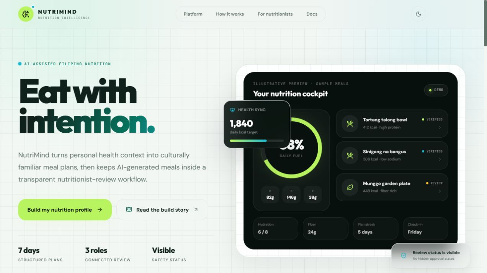

# Frontend polish handoff — September 10, 2026

The existing NutriMind dashboard, visual tokens, shared portal layouts, and API contracts are preserved. This delivery fixes misleading evidence, grocery cache safety, locality prerequisites, keyboard behavior, and several connected mobile presentation issues. It is statically verified and component-tested, with public browser evidence. Authenticated visual acceptance remains outstanding.

## Delivery boundary

- Branch: `codex/frontend-polish`.
- Starting commit: `a72ec52cc9f671babf85e150dea3abd15854a6ac` (detached worktree at task start).
- The final delivery commit hash is supplied with this report in the task handoff; `git log -1 --oneline` identifies it in the delivered branch.
- `development` remains `1ebbf197735cc395a6ff1fb9afb473c3a8a4e632`.
- `main` remains `d17b30482398472a02eefd505950f8b42af6b223`.
- Neither branch was checked out, merged into, or modified. No push or deployment was performed.
- The initial six modified/untracked locality files were preserved and finished: the package manifest/lockfile, locality component/test, test setup, and new Slider primitive. The existing Radix slider dependency is included in the delivery; no additional framework was introduced.
- No backend business logic, Prisma schema/migrations, payment behavior, authentication contract, environment configuration, dataset, or Cloudinary assignment was changed.
- No secrets or real credentials were read, copied, logged, or committed. No real user records or personal health data were used. Tests use synthetic component data and the repository's existing public adversarial test inputs.

## Audit checklist and result

| Area | Finding and disposition |
| --- | --- |
| Repository/context | Read operational guidance, contributor setup, current engineering evidence, recent history, existing changes, and the development diff. Inspected relevant API types, cache code, layouts, tokens, and shared components before edits. |
| Landing → authentication | Existing shared palette and typography retained. Landing sample now says “Illustrative preview · sample meals” and “Demo,” instead of claiming a live synchronized plan. Desktop landing and 390px login inspected in the browser. |
| Dashboard | Preserved the cockpit direction; allowed two-line meal names; separated detail navigation from logging; retained pending previews on mixed approved/pending days; restored incomplete-nutrition disclosure. |
| Meal cards/detail/images | Shared image corrections apply across existing consumers. Exact persisted image metadata takes priority. Missing images only use approved local photos for their exact reviewed recipe names; all other names use category illustrations. |
| Plan / History / Library | Existing navigation and cache hooks retained. Section buttons now announce pressed state rather than pretending to be separate current pages. |
| Grocery | Shared fetch/projection policy prevents dashboard cache pollution and preserves pending-review counts; localized error/loading handling retained. |
| Progress / Health Profile | Dashboard review card links directly to both routes. Locality controls validate the supplied Region and Province/HUC against the API's available hierarchy. |
| Nutritionist | Clarified FNRI as nutrition provenance, not professional verification; queue failure no longer reads as an empty successful queue; refresh has an explicit accessible name. |
| Admin data/images | Existing data workspace organization retained. Shared tabs gain visible focus. Mobile role navigation scrolls instead of forcing eight entries beyond the viewport. Image search stacks on narrow screens and has a reusable empty state. Unassigned records cannot masquerade as persisted assignments through local photo fallback. |
| Shared states/accessibility | Added global keyboard focus fallback and reduced-motion CSS, explicit MealImage skeleton motion opt-out, labelled mobile navigation/current links, and separate cockpit button semantics. Existing Radix modal behavior and cached route rendering retained. |
| Browser acceptance | Public checks passed. Private role journeys require a configured synthetic authenticated environment and were not bypassed or claimed as verified. |

## Defects fixed

1. Removed browser-generated condition-specific advice and the “Clinical Guidance,” “clinical-grade,” and “Allergen Safe” claims from `NutritionistGuidanceCard`. It no longer accepts conditions, allergies, or reviewer identity, so `NONE` cannot become an active-allergy claim and a first-row reviewer cannot be attributed advice they never authored. No replacement medical advice was invented.
2. Replaced `GroceryPreviewCard`'s forced `pendingMealCount: 0` write with the same authoritative two-endpoint check used by Grocery. Zero approved current meals suppress stale groceries; mixed plans retain the pending count; failed response envelopes do not overwrite the cache as safe. The preview revalidates cached data on mount and ignores late results after owner changes/unmount.
3. Fixed generic vegetable/egg precedence over primary meat in category fallbacks, including beef tapa with egg and beef with cabbage. Structured FNRI animal-protein categories take priority. Eggplant no longer matches egg. The vegetable illustration label makes no plant-based dietary certification claim.
4. Disabled MealImage loading pulse under reduced motion; added a global fallback for CSS transitions/animations and custom scan/float effects.
5. Removed broad keyword photo substitution (such as poultry adobo receiving a pork photo). Moved exact approved local identities and attribution into `reviewed-meal-images.ts`, using the seven rows of `docs/meal-images/generated/approved-meal-images.csv`. Restored source URLs and the exact recorded oatmeal creator. Persisted API images still override local fallback. No external provenance was reconstructed from memory.
6. Added direct behavioral tests for the guidance card, grocery preview, cockpit, and retained hero component, plus image/locality regressions.
7. Removed inferred whole-plan PRC verification from the retained DashboardHero. Lack of a pending flag now yields only the supplied plan type or no-active-plan state.
8. Fixed mixed-day pending previews disappearing when any approved meal existed.
9. Fixed Enter/Space on a nested logging control also opening meal detail; navigation and logging are now sibling native buttons. Only approved rows receive logging controls.
10. Restored unresolved outside-meal nutrition warnings and removed the cockpit's unsupported 2,500 mL target; it displays the logged water amount with named add/remove controls.
11. Fixed nonempty invalid location text unlocking locality stops, incompatible Province/HUC unlocking Local, missing prerequisite descriptions, and ambiguous keyboard End behavior. National remains available; unavailable locations clamp to the highest validated stop; the slider is disabled during save or when only National is available.
12. Fixed hidden mobile role-navigation overflow, missing focus feedback in shared tabs/mobile links, and inactive Home state on nested dashboard routes.
13. Fixed image error state sticking when a different URL replaces a failed image, overlapping full-size representative/attribution pills, and a thumbnail disclosure represented only by an unexplained dot.
14. Fixed misleading nutritionist empty/error and FNRI title wording, missing Admin image search empty state, and unassigned Admin rows displaying a local photo as if assigned.
15. Clarified the public landing sample as an illustrative demo rather than live user data.

## Reuse and components

- New shared `fetchCurrentGrocery` and grocery types serve both the preview and full page.
- New `usePlanningLocations` and `validPlanningLocation` share location lookup/validation between the fields and strength control.
- Finished the existing Radix-based `Slider`; accessible descriptions reach its thumb.
- Reused `Card`, `Button`, `EmptyState`, shared role layouts, current session-resource cache, existing API client, and existing route-loading architecture.
- Retained the guidance-card export for the existing dashboard composition, with informational review/profile content instead of medical advice.

## Verification

| Command/check | Final result |
| --- | --- |
| `npm run install:all` | Passed using the three existing lockfiles; each install audit reported 0 vulnerabilities. |
| `git diff --check` | Passed; no whitespace errors. |
| `npm run architecture:check` | Passed; every handwritten source module remains at or below 900 lines. |
| `npm run format:check` | Passed. Initial formatting warnings in 18 edited files were corrected. |
| `npm --prefix frontend run lint` | Passed, 0 errors / 0 warnings. One intermediate unused-state warning was corrected. |
| `npm --prefix frontend test` | **19 test files passed; 68 tests passed; 0 failed.** |
| `npm --prefix frontend run build` | Passed; 45/45 static generation steps completed and all routes built. Repeated after the final landing-copy correction. |
| `npx prisma generate` in `backend` | Passed; generated local client only, no database connection/migration. |
| `npx tsc --noEmit` in `backend` | Passed, 0 errors. |
| Existing `public-access.spec.ts` via `npx playwright test --config playwright.polish.config.ts` | **2 Chromium tests passed; 0 failed.** Repeated against the final production build. Temporary config only pointed the existing tests at the task-owned loopback server; it was removed. |
| Browser: landing → login | Passed visible navigation/continuity inspection. |
| Browser: 390×844 login | No horizontal overflow (`scrollWidth = innerWidth = 390`); screenshot inspected. |

The final preview server was task-owned on loopback port 3012 and was stopped. Temporary browser tabs were closed and the viewport override was reset. The Next preview command emitted the repository's standalone-output startup advisory; the server served the production build successfully. No deployment was performed.

## Exact files changed

Repository-relative paths (including carried-forward locality changes):

```text
docs/NUTRIMIND_ENGINEERING_RECORD.md
docs/FRONTEND_POLISH_HANDOFF_2026-09-10.md
docs/verification/frontend-polish/landing-desktop.png
docs/verification/frontend-polish/login-mobile.png
frontend/package.json
frontend/package-lock.json
frontend/src/app/page.tsx
frontend/src/app/globals.css
frontend/src/app/(admin)/admin/images/page.tsx
frontend/src/app/(nutritionist)/nutritionist/reviews/page.tsx
frontend/src/app/(user)/dashboard/page.tsx
frontend/src/app/(user)/grocery/page.tsx
frontend/src/app/(user)/meals/page.tsx
frontend/src/components/shared/PortalRoleLayout.tsx
frontend/src/components/ui/BottomNav.tsx
frontend/src/components/ui/Slider.tsx
frontend/src/components/ui/Tabs.tsx
frontend/src/components/user/MealImage.tsx
frontend/src/components/user/MealImage.test.tsx
frontend/src/components/user/reviewed-meal-images.ts
frontend/src/components/user/MealLocalityPreferenceControl.tsx
frontend/src/components/user/MealLocalityPreferenceControl.test.tsx
frontend/src/components/user/PlanningLocationFields.tsx
frontend/src/components/user/PlanningLocalityJourney.test.tsx
frontend/src/features/dashboard/CockpitDashboard.tsx
frontend/src/features/dashboard/CockpitDashboard.test.tsx
frontend/src/features/dashboard/DashboardHero.tsx
frontend/src/features/dashboard/DashboardHero.test.tsx
frontend/src/features/dashboard/GroceryPreviewCard.tsx
frontend/src/features/dashboard/GroceryPreviewCard.test.tsx
frontend/src/features/dashboard/NutritionistGuidanceCard.tsx
frontend/src/features/dashboard/NutritionistGuidanceCard.test.tsx
frontend/src/features/grocery/current-grocery.ts
frontend/src/hooks/usePlanningLocations.ts
frontend/src/test/setup.ts
```

## Visual evidence and remaining checks




Authenticated browser screenshots were unavailable because this isolated worktree had no configured backend/synthetic authenticated service. No owner password was requested and authentication was not bypassed. The screenshots demonstrate public visual continuity only; they are not evidence for the corrected authenticated dashboard.

Before release, use documented synthetic accounts to inspect desktop and 390px dashboard/detail, mixed approved/pending Grocery, Health Profile location selection and persistence after save, one nutritionist review, and Admin data/images. Check keyboard order, horizontal scrolling in role navigation, image source/license links, both themes, reduced-motion behavior, and touch target comfort at 390px. Component tests establish the corrected logic but do not establish full accessibility conformance or private browser layout acceptance.

Existing backend clinical-policy limitations, legacy provenance concerns, provider behavior, production readiness, and authenticated cache freshness outside the corrected grocery flow remain governed by the engineering record. No clinical certification, universal allergen safety, new active locality consumption evidence, production image assignment, or deployment is claimed.
